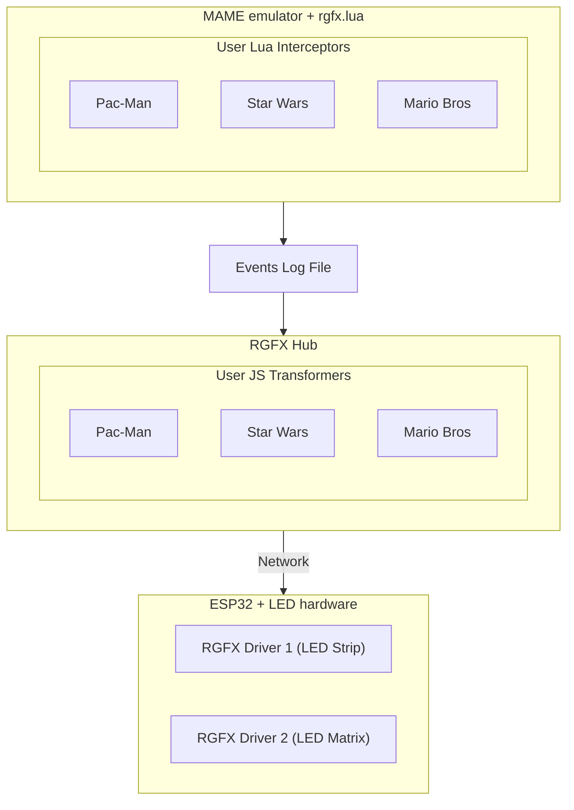

# System Architecture

RGFX is a distributed system that monitors retro arcade games and translates game events into LED effects across physical devices.

## Component Overview

In this example we have three games creating effects on two drivers.

## Data Flow

1. **MAME** runs a retro game with a Lua interceptor loaded
2. **Lua Interceptor** monitors game memory and writes events to a log file
3. **RGFX Hub** watches the log file and maps events to LED effects
4. **UDP messages** deliver effect commands to ESP32 drivers in real-time
5. **MQTT** handles configuration, status reporting, and firmware updates
6. **ESP32 Drivers** render effects on connected LED hardware

## Communication Protocols

| Protocol | Purpose | Latency |
|----------|---------|---------|
| UDP | Real-time effect delivery | Low (~1ms) |
| MQTT (QoS 2) | Configuration, logging, OTA | Reliable |
| SSDP | Broker discovery | One-time |
| mDNS | OTA hostname resolution | One-time |

## Learn More

- [Getting Started](getting-started.md) - Set up your first RGFX installation
