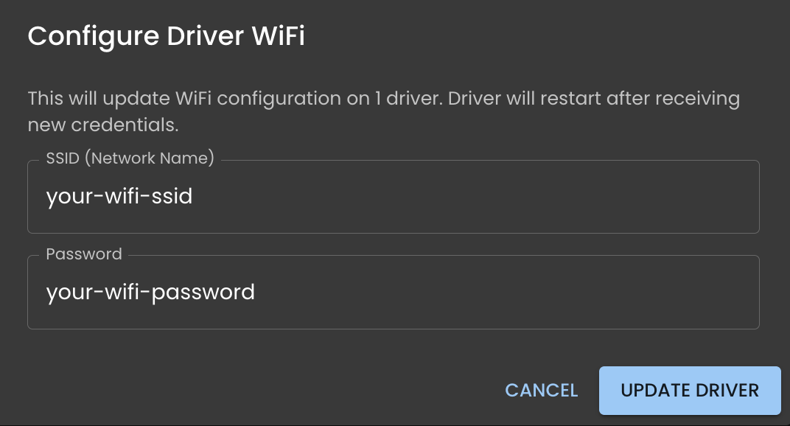

# Install Firmware and Configure WiFi

Flash the RGFX firmware to an ESP32 and connect it to your WiFi network.

## What You Need

- ESP32 development board (ESP32-WROOM-32 or ESP32-S3)
- USB cable

## Flash and Configure

1. Connect the ESP32 to your computer via USB
2. In RGFX Hub, go to **Firmware** and select **USB Serial**
3. Select the serial port from the dropdown
4. Click **Update Firmware** and wait for completion
5. Click **Configure WiFi** and enter your network credentials

    { width="50%" }

6. Click **Send to Device**
7. The ESP32 reboots and joins your network

Once connected, the driver appears as online on the Hub's **Drivers** page.

## Next Step

[Configure your LED hardware](configure-leds.md) to set up your LED strips or matrices.
