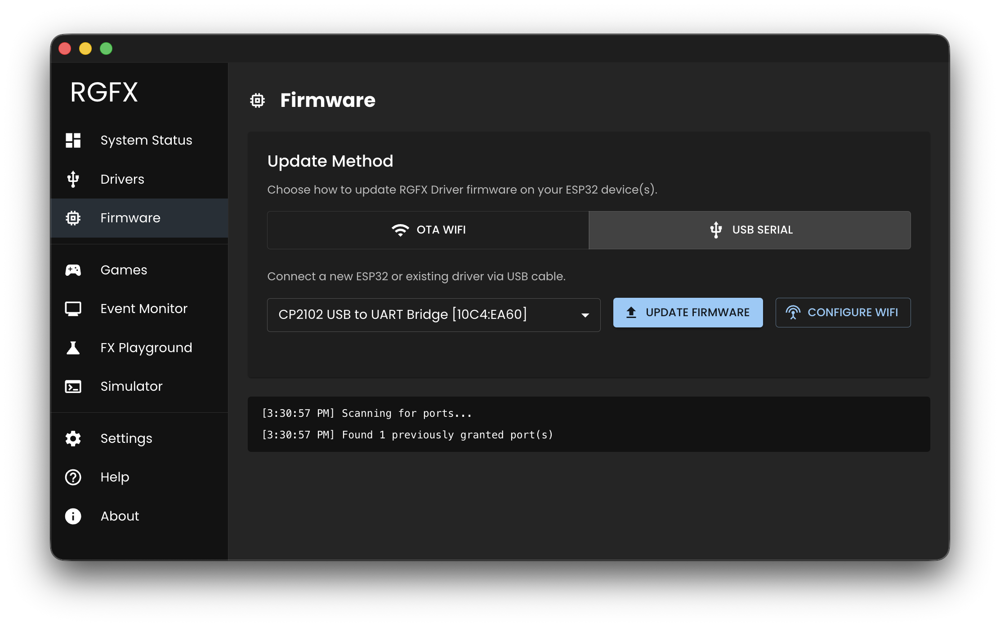

# Flash Your First Driver

A driver is an ESP32 board running the RGFX firmware with LEDs connected to it. In this step you'll flash the firmware, connect to WiFi, and configure your LED hardware.

## Connect the ESP32

Plug your ESP32 development board into your computer using a USB cable.

!!! warning
    Make sure you're using a **data** USB cable, not a charge-only cable. Charge-only cables won't show a serial port. If nothing appears in the port dropdown, try a different cable.

## Flash the Firmware

1. In RGFX Hub, go to **Firmware** in the sidebar
2. Select **USB Serial** as the update method
3. Choose the serial port from the dropdown
4. Click **Update Firmware** and wait for completion

The Hub detects your ESP32's chip type automatically and selects the correct firmware.

## Configure WiFi

After flashing:

1. Click **Configure WiFi**
2. Enter your WiFi network name and password
3. Click **Send to Device**

{ width="50%" }

The ESP32 reboots and joins your network. Once connected, the driver appears on the Hub's **Drivers** page with a green "Connected" status.

## Configure LED Hardware

Now tell the driver what LEDs are connected to it:

1. Click on your driver in the [Drivers](../hub-app/drivers.md) list
2. Click **Configure Driver**
3. Select your LED hardware definition from the dropdown (or add a custom one)
4. Set the **GPIO pin** connected to your LED data line (default: 16)
5. Adjust **brightness** and **power limits** to match your setup
6. Click **Save Configuration**

The settings are pushed to the driver over the network. For a full reference of all configuration options, see [LED Configuration](../hardware/configure.md).

## Next Step

[Test your LEDs :material-arrow-right:](../hub-app/test-leds.md)
