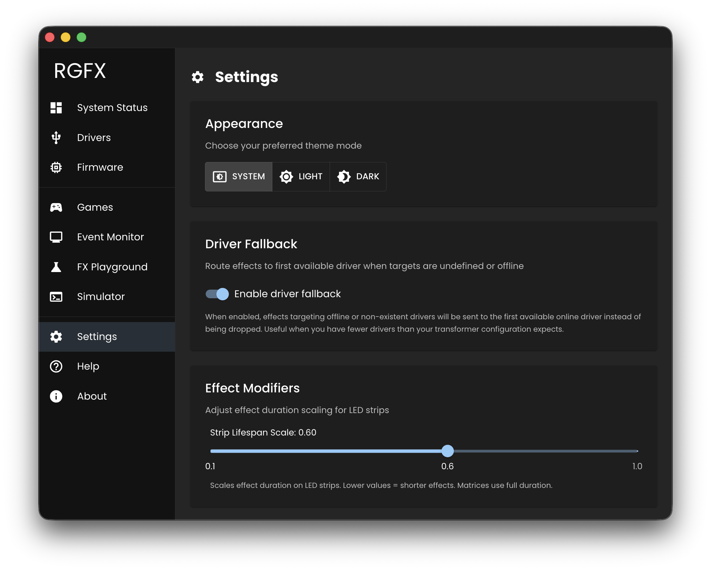

# Set Up RGFX Hub

The RGFX Hub is the desktop application that ties everything together. It watches for game events from MAME, decides which LED effects to trigger, and sends commands to your ESP32 drivers over WiFi. It also handles firmware updates and driver configuration.

## Config Directory

RGFX stores all user-editable files in a single config directory:

| Platform | Default Path |
|----------|-------------|
| macOS | `/Users/<username>/.rgfx/` |
| Windows | `C:\Users\<username>\.rgfx\` |

The directory structure:

```
interceptors/
├── rom_map.json               # Maps ROM variant names to interceptors
└── games/
    ├── pacman_rgfx.lua        # Pac-Man interceptor
    ├── galaga_rgfx.lua        # Galaga interceptor
    ├── robotron_rgfx.lua      # Robotron interceptor
    └── ...                    # More example games
transformers/
├── default.js                 # Default effect handler
├── global.js                  # Driver group configuration
├── bitmaps/                   # Sprite data for bitmap effects
├── games/
│   ├── pacman.js              # Pac-Man effects
│   ├── galaga.js              # Galaga effects
│   └── ...                    # More example games
├── subjects/                  # Shared handlers (audio, ambilight)
├── properties/                # Generic property handlers
└── utils/                     # Utility functions
led-hardware/                  # LED hardware definitions
drivers.json                   # Driver configurations (auto-generated)
logs/                          # Log files (auto-generated)
interceptor-events.log         # Event output (auto-generated)
```

## First Launch

On first launch, the Hub copies default interceptor and transformer scripts to the config directory. This gives you a working set of [example game scripts](../example-games.md).

## Configure Settings

Go to **[Settings](../hub-app/settings.md)** in the sidebar and configure:



### MAME ROMs Directory

**Optional.** Point this to the folder where your MAME ROM files are stored. This allows the [Games](../hub-app/games.md) page to show which ROMs have matching interceptors and transformers.

## Next Step

[Flash your first driver :material-arrow-right:](first-driver.md)
