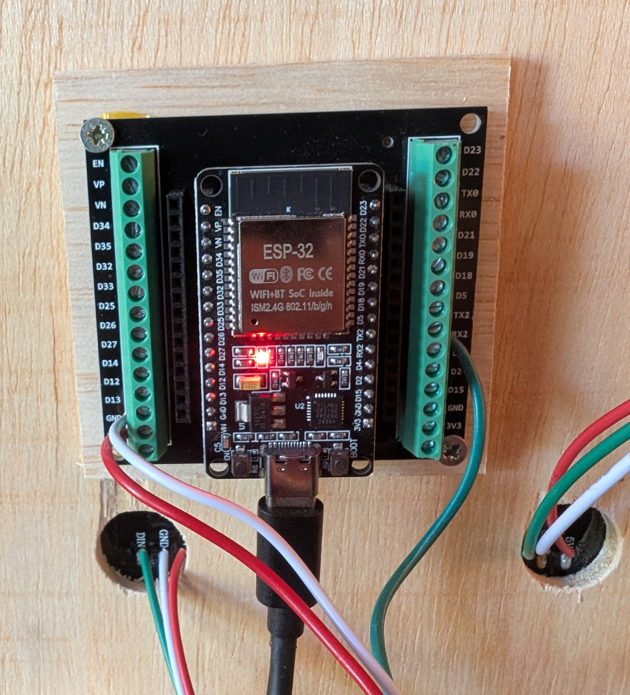

# Choosing Hardware

This page helps you pick the right ESP32 board and LEDs for your RGFX setup.

## ESP32 Boards

RGFX runs on ESP32 microcontrollers. These are small, inexpensive WiFi-enabled boards that can drive addressable LEDs directly from a single GPIO pin.

### Recommended: ESP32-WROOM-32

The ESP32-WROOM development board is the best starting point. It's widely available, well-documented, inexpensive (~$8), and has excellent WiFi. The dual-core processor handles real-time LED rendering and network communication simultaneously.

A 38-pin breakout board makes wiring easy — the 5V, GND, and DATA pins connect to LEDs using JST SM connectors for a clean plug-and-play setup.

> Note the **RESET** and **BOOT** buttons at the left and right of the USB input. The BOOT button is used to toggle the LED test pattern during hardware setup.

### Also Compatible

| Board | Notes |
|-------|-------|
| ESP32-S3 DevKitC | Newer generation, works well with RGFX |
| NodeMCU-32S | Common WROOM-32 variant |
| Wemos D1 Mini ESP32 | Compact form factor |
| ESP32-C3 Super Mini | Smallest and cheapest option, but requires soldering headers and has fewer breakout options |

Any ESP32 dev board using a WROOM-32 or S3 chip should work. The Hub detects the chip type automatically when flashing firmware.

## LED Types

RGFX uses addressable LED strips and matrices — each LED can be individually controlled.

### RGB LEDs

- **WS2812B** (also sold as NeoPixel) — the default choice. Most common, best documented, available everywhere.
- **WS2811** — similar protocol, often used in larger installations with higher voltage.

### RGBW LEDs

- **SK6812** — 4-channel LEDs with a dedicated white channel for better color rendering and brighter whites.

### Where to Buy

Search for "WS2812B LED strip" or "WS2812B LED matrix" on Amazon, AliExpress, or your preferred electronics supplier. Common formats:

- **Strips**: 30 LEDs/m or 60 LEDs/m, sold in 1m-5m lengths
- **Flexible matrices**: 8x8, 16x16, 32x8 panels

## Strips vs Matrices

| | LED Strips | LED Matrices |
|---|---|---|
| **Best for** | Accent lighting, cabinet edges, marquee | Score displays, bitmaps, scrolling text |
| **Layout** | 1D — linear effects, pulses, wipes | 2D — full effects including bitmaps and text rendering |
| **Price** | ~$10 for 1 meter | ~$15-25 per panel |
| **Mounting** | Adhesive backing, easy to position | Attach to project board with double-sided tape |
| **Combine** | Longer strips or multiple runs | Multiple panels for larger displays |

Most setups benefit from at least one strip and one matrix, but start with whichever matches what you want to see first.

## Multi-Panel Displays

Multiple identical LED matrices can be combined into a single unified display. RGFX handles the panel mapping so effects render seamlessly across all panels. See [Build Examples](examples.md) for photos and configurations.

## Color Orders

Different LED chipsets wire their color channels differently. The most common orders:

- **GRB** — WS2812B default (most common)
- **RGB** — standard order
- **BRG** — some LED variants

If your colors appear wrong (e.g., red shows as green), adjust the color order in [LED Configuration](configure.md).
