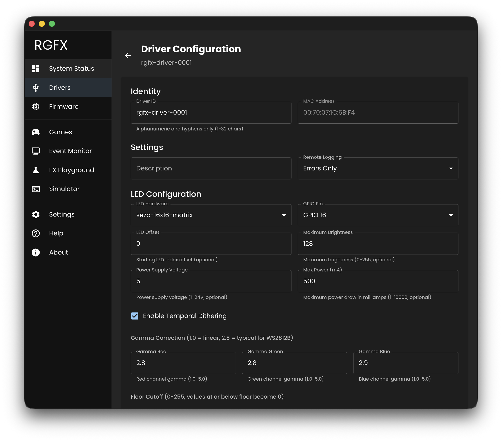
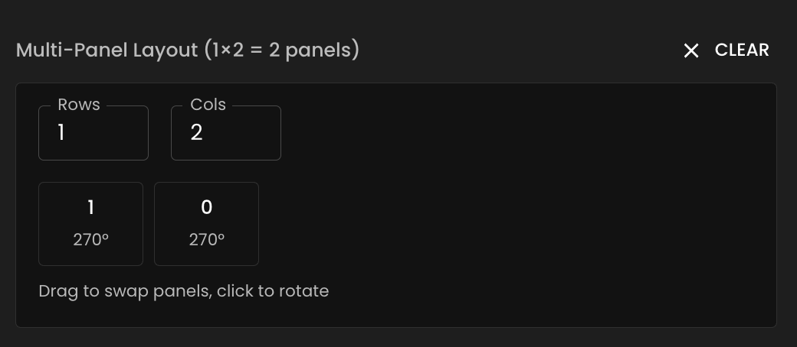

# Configure LED Hardware

Configure your driver's LED strip or matrix settings in RGFX Hub.

## Access Driver Configuration

1. Go to the [Drivers](../hub-app/drivers.md) page
2. Click on a driver to view its [Driver Detail](../hub-app/driver-detail.md) page
3. Click **Configure Driver**

## LED Configuration Settings

### LED Hardware

Select your LED hardware from the dropdown. Hardware definitions describe physical properties like LED count, chipset, color order, and layout type. See [Choosing Hardware](choosing.md) for guidance.

If your hardware isn't listed, you can [create custom definitions](definitions.md) in the `led-hardware/` folder in your [config directory](../getting-started/hub-setup.md#config-directory).

### GPIO Pin

The ESP32 GPIO pin connected to your LED data line. Valid range: 0-48 (varies by chip variant). Default: 16. See [Wiring & Power](wiring.md) for connection details.

### LED Offset

Optional starting index offset. Use this if you want to skip LEDs at the beginning of the strip.

### Maximum Brightness

Limits the maximum per-LED brightness (0-255). Useful for power management or reducing eye strain.

### Global Brightness Limit

An additional global cap on overall brightness (0-255), applied after maximum brightness. Allows finer control over display intensity.

### Power Settings

- **Power Supply Voltage**: Your power supply voltage (1-24V)
- **Max Power (mA)**: Maximum power draw in milliamps. The driver will scale brightness to stay within this limit.

### Temporal Dithering

Smooths color transitions at low brightness by rapidly alternating between nearby color values. Recommended for most setups.

### Gamma Correction

Compensates for non-linear human brightness perception. Each RGB channel can be configured independently. Default: 2.8 for all channels (typical for WS2812B).

- 1.0 = Linear (no correction)
- 2.8 = Typical LED correction

### Floor Cutoff

Values at or below this threshold become 0 (off). Useful for eliminating dim flicker. Configure per RGB channel (0-255).

## Strip-Specific Settings

### Reverse Direction

When enabled, logical LED index 0 maps to the last physical LED. Use this if your strip is mounted in the opposite direction.

## Matrix-Specific Settings

### Panel Rotation

For single-panel matrices (not using unified multi-panel layout), rotate the display:

- `0` degrees (default)
- `90` degrees
- `180` degrees
- `270` degrees

Multi-panel unified layouts use per-panel rotation in the layout editor instead.

### Unified Multi-Panel Layout

For multi-panel matrix setups, the panel layout editor lets you arrange panels in a grid and specify rotation for each panel.

Each panel entry uses the format `<index><rotation>`:

- **Index**: Panel position in the physical LED chain (0 = first panel wired)
- **Rotation**: Optional letter for rotation
    - `a` = 0 degrees (default)
    - `b` = 90 degrees
    - `c` = 180 degrees
    - `d` = 270 degrees

Example: A 2x2 grid with `[["0a", "1b"], ["3d", "2c"]]` arranges four panels with different rotations.

## RGBW-Specific Settings

For 4-channel RGBW LED strips (like SK6812 RGBW), select the color mode:

- **Exact Colors**: Prioritizes color accuracy, uses white channel sparingly
- **Max Brightness**: Maximizes white channel output for brighter whites

## Save Configuration

Click **Save Configuration** to apply changes. The driver will receive the new settings over the network. Use [Test LEDs](../getting-started/test-leds.md) to verify your configuration is correct.
