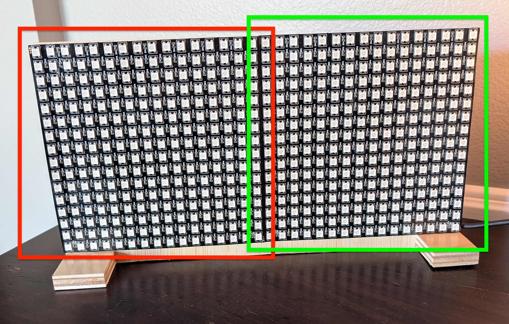
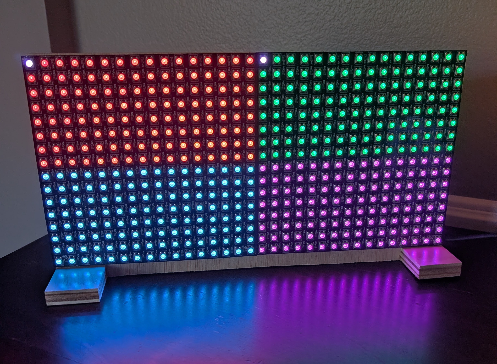
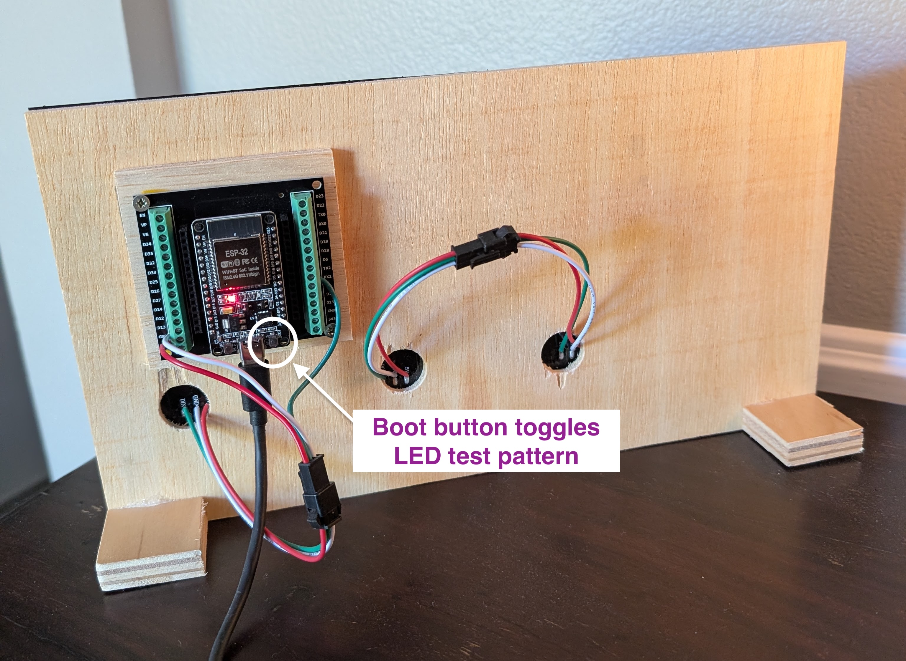
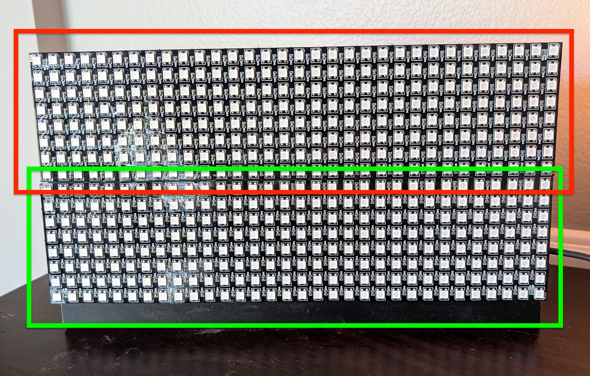
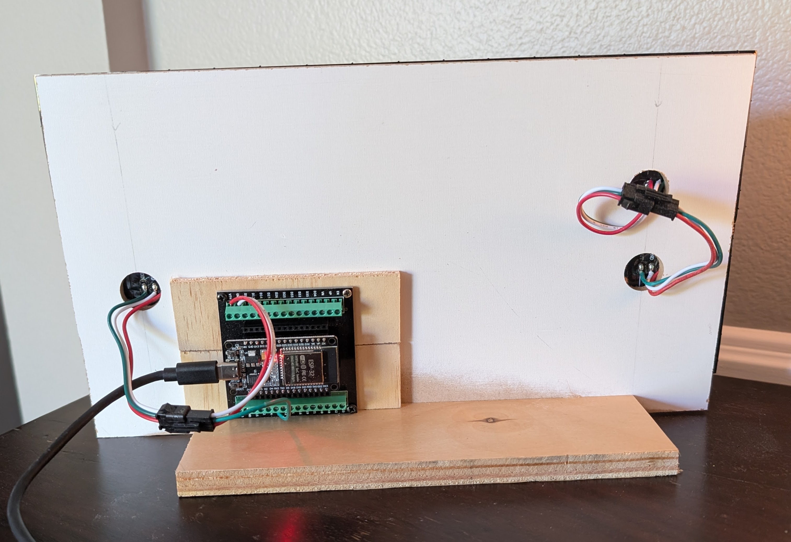
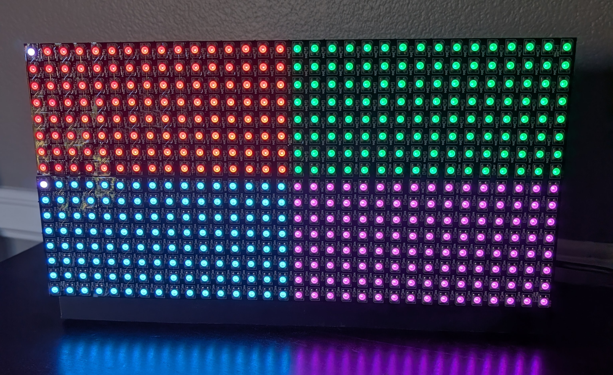
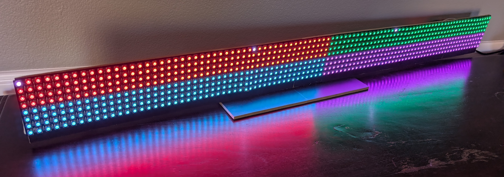

# Hardware Examples

Individual LED matrices can be combined to create larger displays. These builds demonstrate various sizes and layout options.

Flexible LED matrices are often available in 8x8, 16x16 and 32x8 configurations. 

## ESP32 Controller

The ESP32-WROOM development board is my recommended microcontroller for RGFX drivers. It provides excellent WiFi connectivity with generous CPU and storage. Perfect for low latency real-time game effects. The onboard 5V pin provides power to the LED hardware.

My preferred plug-n-play connection method uses a 38-pin ESP32 breakout board. The 5V, GND and DATA pins are connected to the LED hardware using included JST SM 3 connectors.

> Note the small **RESET** and **BOOT** buttons at the left and right of the USB input.

_Higher voltage and amperage setups can be created, but are out of scope for this documentation._

_ESP32-S3 Mini is also supported. These are smaller and a little less expensive, but more difficult to work with — requiring soldering headers, and the S3 Mini has fewer breakout options._

---

## 32x16 Display Example

Two 16x16 LED matrices arranged horizontally, creating a unified 32x16 display. The flexible matrices are mounted to 1/4" project board with double-sided tape. This configuration works well for many effect types.

### Front View

> Matrix 1 is outlined in green, matrix 2 is outlined in red.

### Test Pattern

Once a driver is configured, the test pattern can be activated by pressing either the ESP32's BOOT button or via the Hub application.

> The test pattern helps verify the order and orientation of the individual matrices. The unified display has four colored quadrants, and the top left of each matrix is identified by a single white LED.

### Rear / Wiring

---

## Alternate 32x16 Display Example

A pair of 32x8 LED matrices stacked vertically, creating a unified 32x16 display.

### Front View

Matrix 1 is outlined in green. Matrix 2 is outlined in red.

### Rear / Wiring

### Test Pattern

> Note the single white LED indicating the top left of each matrix.

---

## 96x8 Display Example

Three 32x8 LED matrices arranged horizontally, creating a 96x8 unified display. This wide configuration is ideal for displaying scores and text messages.

### Test Pattern

> The white LEDs indicate the top left corner of each matrix.

