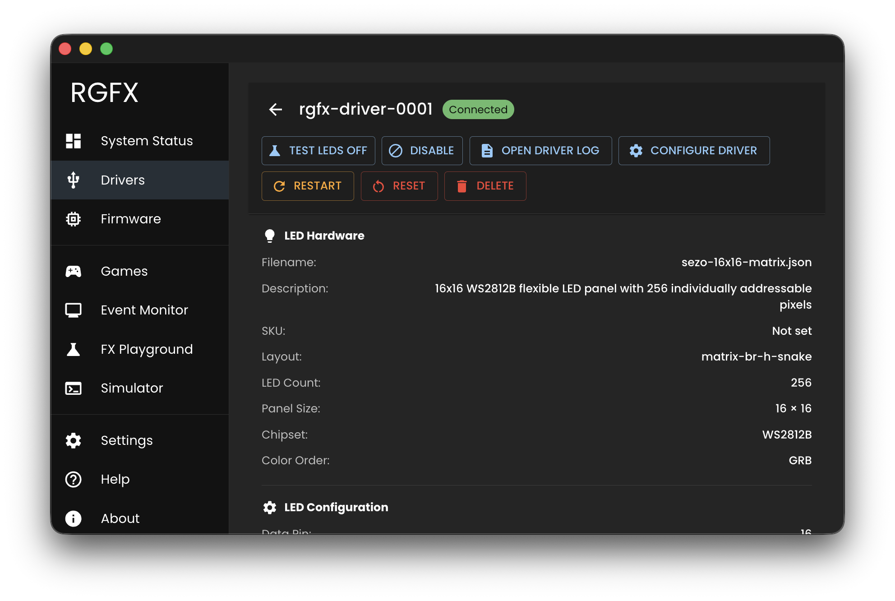

# Driver Detail

The Driver Detail page shows everything about a single ESP32 driver — its LED configuration, network status, hardware specs, and real-time performance. Access it by clicking any row in the [Drivers](drivers.md) list.

## LED Hardware

Displays the selected LED hardware definition for this driver, including the hardware type and configuration source file.

## LED Configuration

Shows the driver's LED settings:

- **GPIO Pin** - Data pin connected to LED strip/matrix
- **Brightness** - Maximum brightness level (0-255)
- **Power Limit** - Maximum power draw in milliwatts
- **Color Order** - LED color channel order (GRB, RGB, etc.)

## Driver Status

Basic identification and network information:

- **Device ID** - User-assigned friendly name
- **MAC Address** - Hardware identifier
- **IP Address** - Current network address
- **Hostname** - mDNS hostname

## Driver Hardware

ESP32 chip specifications:

- **Chip Model** - ESP32, ESP32-S3, etc.
- **CPU Cores** - Number of processor cores
- **Free Heap** - Available memory

## Driver Telemetry

Real-time performance metrics:

- **FPS** - Current frames per second
- **Uptime** - Time since last reboot
- **Last Seen** - Timestamp of last communication

## Actions

Available actions for the driver:

- **Test LED** - Toggle LED test pattern to verify the driver is communicating and LEDs are working. See [Test LEDs](../getting-started/test-leds.md) for details.
- **Configure Driver** - Edit driver settings (see [LED Configuration](../hardware/configure.md))
- **Reset** - Factory reset (erases ID, LED config, WiFi)
- **Restart** - Reboot the driver
- **Disable/Enable** - Toggle driver participation
- **Delete** - Remove driver from Hub
