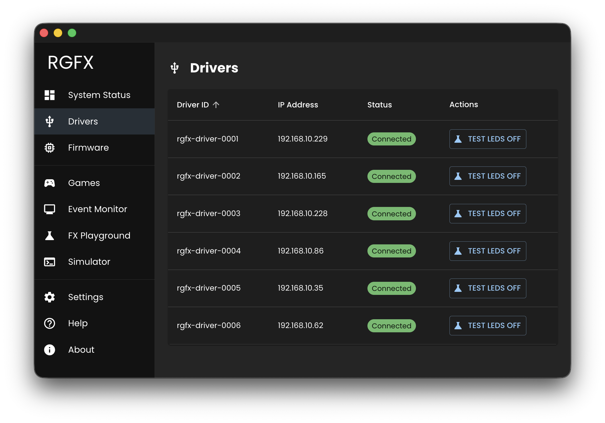

# Drivers

The Drivers page is where you manage your ESP32 devices. It shows every driver the Hub has seen, their connection status, and provides quick access to testing and configuration.

## Driver List

A sortable table shows:

| Column | Description |
|--------|-------------|
| Device ID | User-assigned identifier |
| IP Address | Driver's network address |
| Status | Connection state |
| Actions | Quick actions (Test LED) |

### Test LED Button

The **Test LED** button in the Actions column toggles a test pattern on the driver's connected LEDs. This helps verify the driver is communicating correctly and the LED hardware is working. See [Test LEDs](../getting-started/test-leds.md) for details on the test patterns.

Click any row to view the [Driver Detail](driver-detail.md) page.

### Status Indicators

- **Connected** (green) - Driver is online and communicating
- **Disconnected** (red) - Driver is offline
- **Update Required** - Firmware update needed
- **Update Available** - Newer firmware available
- **Needs Configuration** - LED hardware not configured

## Driver Detail Page

Click a driver row to view:

- **LED Hardware** - Selected hardware definition
- **LED Configuration** - GPIO pin, brightness, power settings
- **Driver Status** - Device ID, MAC address, IP, hostname
- **Driver Hardware** - ESP32 chip model, cores, heap memory
- **Driver Telemetry** - FPS, uptime, last seen timestamp

### Driver Actions

- **Test LED** - Activate LED test pattern
- **Configure Driver** - Edit driver settings
- **Reset** - Factory reset (erases ID, LED config, WiFi)
- **Restart** - Reboot the driver
- **Disable/Enable** - Toggle driver participation
- **Delete** - Remove driver from Hub

## Configure Driver

See [LED Configuration](../hardware/configure.md) for configuration options.
