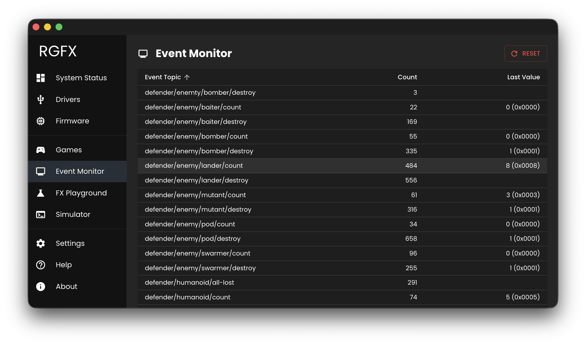

# Event Monitor

The Event Monitor shows game events streaming in real-time as you play. It's useful for verifying that your interceptor is detecting events correctly and for understanding what's happening behind the scenes.

## Event Table

| Column | Description |
|--------|-------------|
| Event Topic | Hierarchical event path (e.g., `pacman/player/score`) |
| Count | Number of times this event occurred |
| Last Value | Most recent payload value |

The table is sortable by topic or count.

## Value Display

Numeric values in the 16-bit range (0-65535) show both decimal and hexadecimal representations (e.g., `2,500 (0x09C4)`).

## Click to Replay

Click any row in the event table to immediately fire that event again through the transformer pipeline with its last recorded value. This triggers the same LED effects as the original event, making it easy to test and iterate on effect mappings without restarting the game.

## Reset Counts

Click **Reset** to clear all event statistics and reset the events processed counter.
