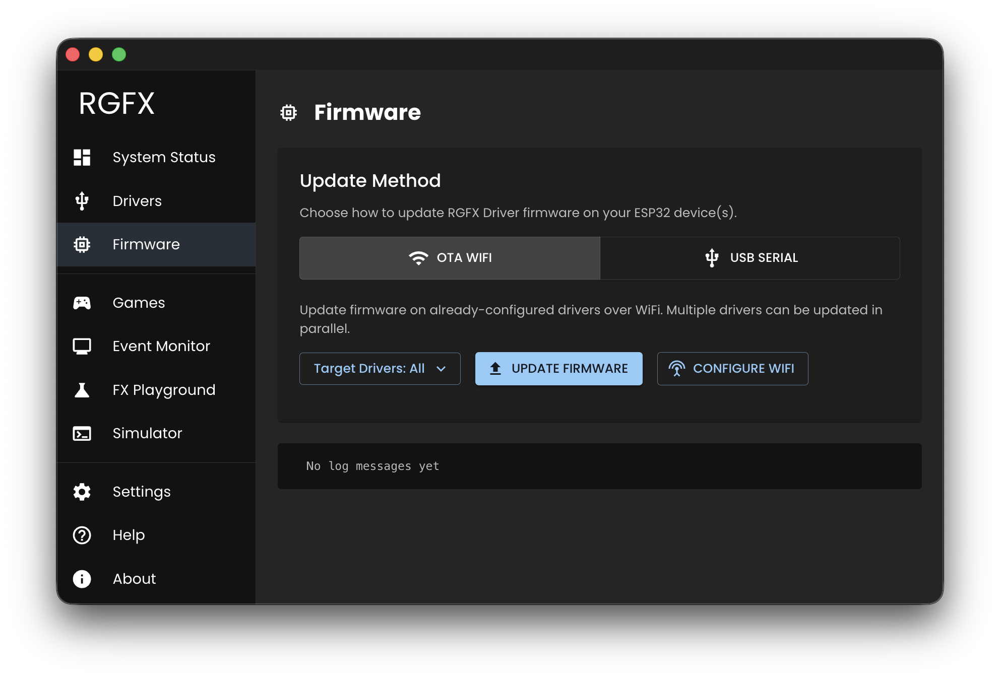

# Firmware

The Firmware page handles flashing and updating your ESP32 drivers. New boards get flashed via USB; existing drivers can be updated over WiFi.

## Update Methods

### OTA WiFi

Update firmware over the network on already-configured drivers.

1. Select target drivers from the picker
2. Click **Update Firmware**
3. Confirm the update
4. Monitor progress for each driver

Multiple drivers can be updated in parallel. Each shows individual progress.

**WiFi Config (OTA)**: Push new WiFi credentials to selected drivers.

### USB Serial

Flash firmware directly via USB cable. Required for new ESP32 boards or recovery situations.

1. Connect ESP32 via USB
2. Select the serial port from the dropdown
3. Click **Update Firmware**
4. Confirm the flash operation
**WiFi Config (USB)**: Configure WiFi credentials on the connected device.

## Chip-Aware Updates

The Hub detects each driver's ESP32 chip type (ESP32, ESP32-S3, etc.) and loads the correct firmware variant automatically.

## Progress and Logging

The log display shows detailed progress during flashing operations.
