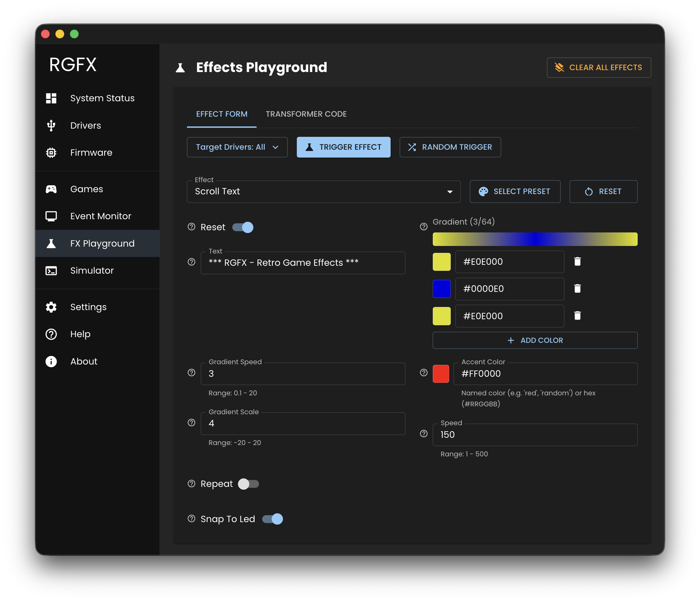

# FX Playground

The FX Playground lets you experiment with all the visual effects interactively — choose an effect, tweak the parameters, and trigger it on your connected drivers.



## Effect Testing

1. Select target drivers from the picker
2. Choose an effect from the dropdown
3. Adjust effect parameters using the form
4. Click **Trigger Effect** to send to drivers

### Reset

Click **Reset** to restore all effect parameters to their default values.

### Randomize

Click **Random Trigger** to apply random parameter values and immediately trigger the effect. Useful for discovering interesting combinations.

### Presets

Some effects (like gradients and plasma) support presets. Click **Select Preset** to choose from predefined configurations.

### Video Playback

The Video effect works differently from other effects — instead of triggering a one-shot command, it streams video frames continuously. Select a video file using the file picker, then use the play/stop controls to manage playback.

### Clear All Effects

Click **Clear All Effects** to immediately stop all running effects on connected drivers.

## Transformer Code Tab

Switch to the **Transformer Code** tab to see JavaScript code that produces the current effect configuration.

Copy this code directly into your transformer scripts:

```javascript
broadcast({
  effect: 'pulse',
  props: {
    color: '#ff0000',
    duration: 500,
  },
});
```
