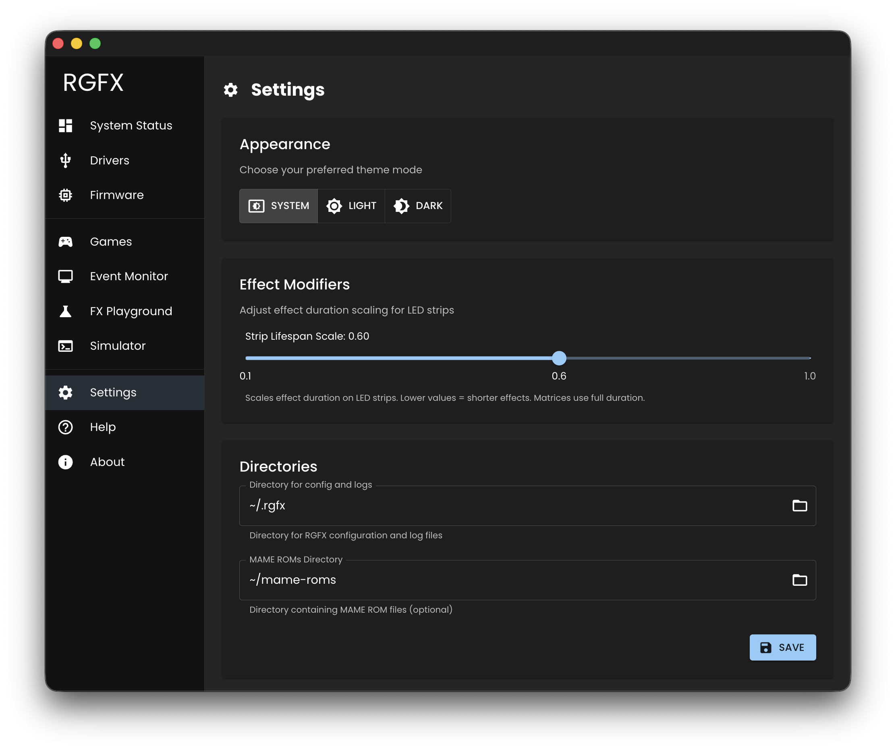
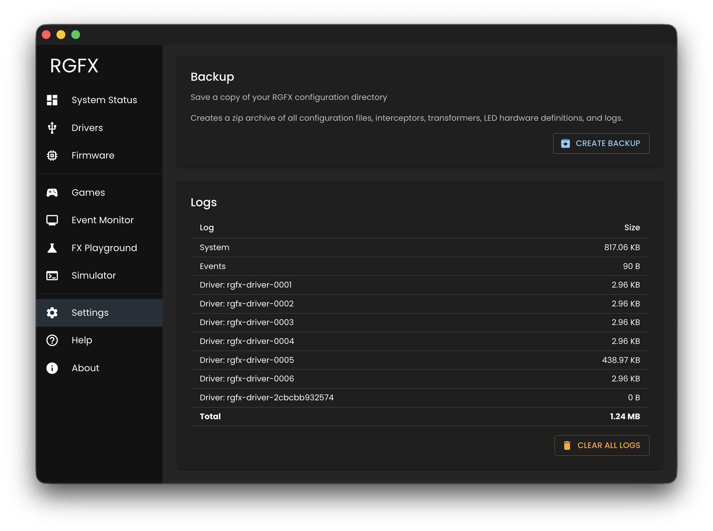

# Settings

Configure the Hub's directories, appearance, and effect behavior.

## Appearance

Choose your preferred theme mode:

- **System** - Follow operating system setting
- **Light** - Light theme
- **Dark** - Dark theme

## Directories

### RGFX Config Directory

**Required.** Location of RGFX configuration files including:

- Interceptor scripts (`interceptors/`)
- Transformer scripts (`transformers/`)
- LED hardware definitions (`led-hardware/`)
- Driver configurations (`drivers/`)

Default: see [Config Directory](../getting-started/hub-setup.md#config-directory)

### MAME ROMs Directory

**Optional.** Path to your MAME ROM files. When configured, the [Games](games.md) page shows which ROMs have interceptors and transformers.

## Driver Fallback

When enabled, effects targeting non-existent or offline drivers are routed to the first available online driver instead of being silently dropped.

This is useful when you have fewer drivers than your transformer configuration expects. For example, the default `global.js` transformer references multiple named drivers — with fallback enabled, all effects will reach your connected driver even if you only have one.

Enabled by default.

## Effect Modifiers

### Strip Explosions

Adjusts the lifespan of explosion effects on LED strips. Lower values create shorter, snappier explosions. Higher values extend the visual decay.

Range: 0.1 to 1.0 (default: 0.6)

## Backup

Creates a zip archive of your entire RGFX configuration directory — interceptors, transformers, LED hardware definitions, driver configs, and logs. Click **Create Backup** to save the archive.

## Logs

Shows the size of each log file:

- **System** — Hub application log
- **Events** — Interceptor event log
- **Driver** logs — One per driver (remote logging)

Hover over any row to see the full file path. Click **Clear All Logs** to permanently delete all log files.

## Saving

Click **Save** to apply directory changes. The Hub validates that directories exist before saving.
