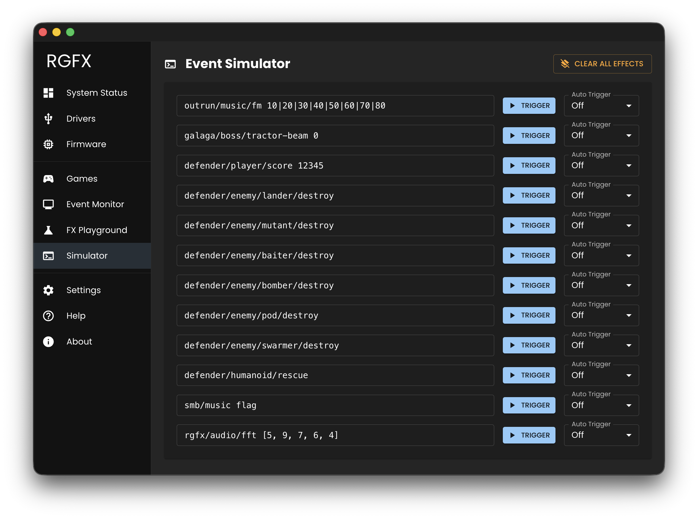

# Event Simulator

The Event Simulator provides manual event triggering for testing transformers without running MAME.



## Event Rows

Twelve configurable rows let you define and trigger events. Each row contains:

- **Event Input**: Text field for the event in `topic payload` format
- **Trigger**: Button to send the event immediately
- **Auto Trigger**: Dropdown to repeat at intervals (Off, 1 second, or 5 seconds)

### Event Format

```
game/subject/property/qualifier payload
```

Examples:

```
pacman/player/score 2500
galaga/enemy/destroyed
dkong/player/action jump
```

Press **Enter** in any event field to trigger it immediately.

## Auto Trigger

When you enable auto-trigger on a row:

1. The event fires immediately
2. The event repeats at the selected interval (1s or 5s)
3. Triggering continues until you set the dropdown back to **Off**

Multiple rows can have auto-trigger enabled simultaneously.

## How It Works

Simulated events are processed through the same transformer pipeline as real MAME events, making this ideal for testing effect mappings without needing a running game.

## Persistence

Event configurations persist across sessions. Your test events and auto-trigger settings are remembered when you reopen the Hub.
