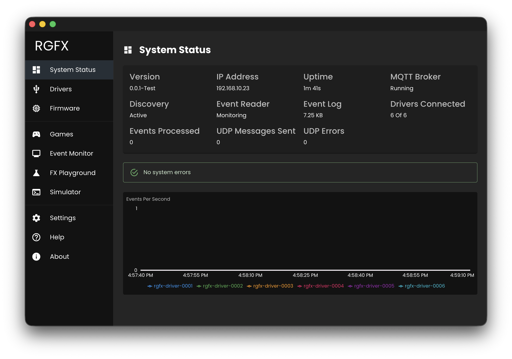

# System Status

The System Status page is the Hub's main dashboard. It gives you a quick overview of whether everything is running correctly — services, drivers, and event processing.

## Status Metrics

- **Version** - Current Hub application version
- **IP Address** - Hub's network IP address
- **Uptime** - How long the Hub has been running
- **MQTT Broker** - Status of the embedded MQTT broker
- **Discovery** - SSDP discovery service status
- **Event Reader** - Status of MAME event log monitoring
- **Event Log** - Size of the interceptor events log file
- **Drivers Connected** - Connected drivers shown as "X of Y" (connected of total registered)
- **Events Processed** - Total events processed this session
- **UDP Messages Sent** - Count of UDP effect messages sent to drivers
- **UDP Errors** - Count of UDP transmission errors

## Network Status

An alert appears when the network is unavailable, indicating the Hub cannot communicate with drivers.

## System Errors

Any system-level errors are displayed in this section with timestamps and descriptions.

## Events Rate Chart

A real-time chart showing the rate of events being processed over time.
