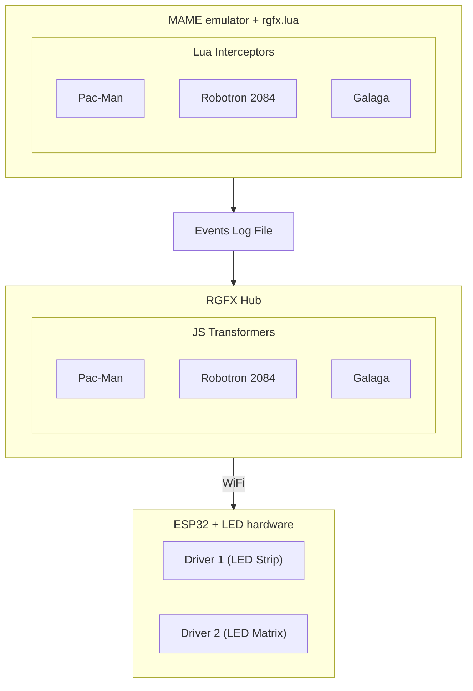

# RGFX — Retro Game Effects

  <video autoplay muted loop playsinline style="width: 100%; margin-top: -25%;">
    <source src="assets/video/hero.webm" type="video/webm" />
    <source src="assets/video/hero.mp4" type="video/mp4" />
  </video>

RGFX monitors game state in MAME and drives real-time LED effects on ESP32 hardware. Lua interceptors watch memory addresses for gameplay events — scoring, deaths, power-ups, level transitions — and transformers map those events to visual effects on your LED strips and matrices over WiFi.

## How It Works

RGFX connects three things together:

1. **MAME** runs your game with a Lua interceptor that watches for gameplay events
2. **RGFX Hub** picks up those events and decides which LED effects to trigger
3. **ESP32 drivers** receive the commands over WiFi and render effects on your LED strips and matrices — in real-time

## What's Included

- **Example games** with interceptors ready to use and modify
- **Visual effects** — pulses, explosions, plasma, particle fields, scrolling text, warp tunnels, and more
- **Ambilight mode** — sample screen edge colors for ambient lighting that follows the game
- **LED strips and matrices** — works with WS2812B and SK6812 addressable LEDs in any layout
- **Multiple drivers** — run several ESP32 boards with different LED setups, all synchronized

## Get Started

- **[Getting Started](getting-started/requirements.md)** — everything you need to go from zero to LEDs reacting to gameplay
- **[Example Games](example-games.md)** — browse included game scripts or learn how to add your favorite game
- **[FX Playground](hub-app/fx-playground.md)** — experiment with effects interactively, no game required
