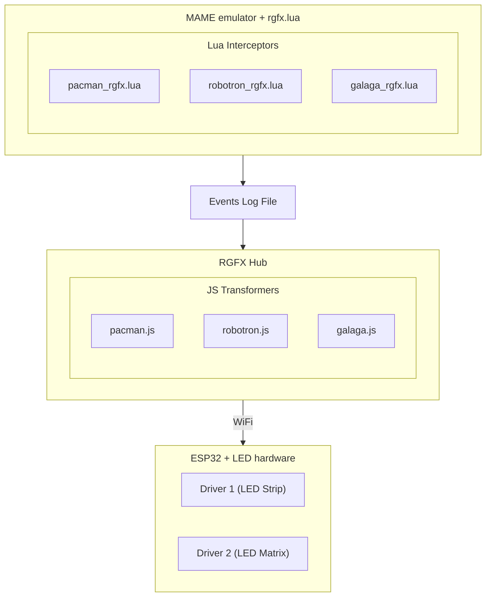

# RGFX — Retro Game Effects

  <video autoplay muted loop playsinline style="width: 100%; margin-top: -25%;">
    <source src="assets/video/hero.webm" type="video/webm" />
    <source src="assets/video/hero.mp4" type="video/mp4" />
  </video>

RGFX monitors game state in MAME and drives real-time LED effects on ESP32 hardware. Lua interceptors watch memory addresses for gameplay events — scoring, deaths, power-ups, level transitions — and transformers map those events to visual effects on your LED strips and matrices over WiFi.

---

[:material-download: Download RGFX](https://github.com/mfurniss/rgfx/releases/latest){ .md-button .md-button--primary }
[:fontawesome-brands-youtube: See it in action](https://youtu.be/gh673Zi6PzE){ .md-button .md-button--primary }

---

## How It Works

RGFX connects three things together:

1. **MAME** runs your game with a Lua interceptor that watches for gameplay events
2. **RGFX Hub** processes those events and converts them to LED effect commands
3. **ESP32 drivers** receive the commands over WiFi and render effects on your LED strips and matrices

This is the flow, using three example games. Of course, many MAME roms are compatible.

## What's Included

- **Example games** with interceptors ready to use and modify
- **Visual effects** — pulses, explosions, plasma, particle fields, scrolling text, warp tunnels, and more
- **Ambilight mode** — sample screen edge colors for ambient lighting that follows the game
- **LED strips and matrices** — works with WS2812B and SK6812 addressable LEDs
- **Multiple drivers** — run several ESP32 boards with different LED setups, all synchronized

---

*All game titles and character names referenced in this project are trademarks of their respective owners. RGFX is an independent project and is not affiliated with, endorsed by, or sponsored by any game publisher or hardware manufacturer.*
