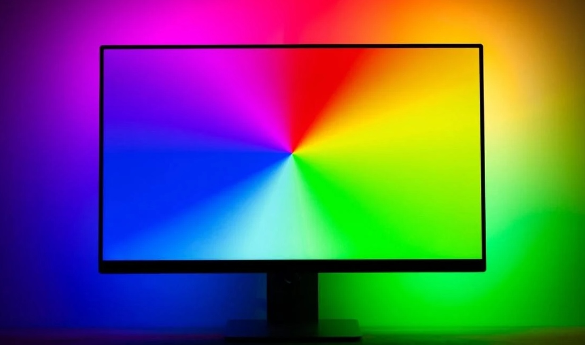

# Ambilight

The ambilight module captures colors from the edges of the game screen, enabling ambient lighting effects that react to on-screen visuals.



```lua
local ambilight = require("ambilight")
```

## Usage

```lua
ambilight.init({
    zones = 16,
    depth = 16,
    event_interval = 4,
    brightness = 0.5,
})
```

## Options

| Option | Default | Description |
|--------|---------|-------------|
| `zones` | 16 | Number of color zones per edge |
| `depth` | 16 | Pixels inward from edge to sample |
| `event_interval` | 4 | Frames to average before emitting event |
| `brightness` | 0.5 | Output brightness multiplier (0-1) |

## Event Emitted

The module emits a single event containing all four edges:

```
rgfx/ambilight/frame
```

The payload contains four pipe-separated segments (left, top, right, bottom), each with comma-separated 12-bit hex colors:

```
F00,0F0,00F,...|F00,0F0,00F,...|F00,0F0,00F,...|F00,0F0,00F,...
```

Colors use 4-bit per channel (12-bit total) for compact payloads.

## Simple Example

This example shows 4 zones per edge for clarity. In practice, 16 zones (the default) provides smoother gradients:

<div class="ambilight-strip">
  <div class="edge-group"><span class="edge-label">left</span><div class="zones"><div style="background:#F00"></div><div style="background:#FF0"></div><div style="background:#0F0"></div><div style="background:#0FF"></div></div></div>
  <div class="edge-group"><span class="edge-label">top</span><div class="zones"><div style="background:#0FF"></div><div style="background:#00F"></div><div style="background:#F0F"></div><div style="background:#F00"></div></div></div>
  <div class="edge-group"><span class="edge-label">right</span><div class="zones"><div style="background:#F00"></div><div style="background:#F80"></div><div style="background:#FF0"></div><div style="background:#8F0"></div></div></div>
  <div class="edge-group"><span class="edge-label">bottom</span><div class="zones"><div style="background:#8F0"></div><div style="background:#0F0"></div><div style="background:#0F8"></div><div style="background:#0FF"></div></div></div>
</div>

```
rgfx/ambilight/frame  F00,FF0,0F0,0FF|0FF,00F,F0F,F00|F00,F80,FF0,8F0|8F0,0F0,0F8,0FF
```

| Segment | Edge | Direction |
|---------|------|-----------|
| 1st | Left | bottom → top |
| 2nd | Top | left → right |
| 3rd | Right | top → bottom |
| 4th | Bottom | right → left |

## How It Works

The module:

1. Samples all four edges of the display clockwise from bottom-left (left → top → right → bottom)
2. Averages pixel colors within each zone's sample depth
3. Accumulates frames and averages over the event interval
4. Applies brightness scaling to the output
5. Emits event only when colors change

## See Also

- [Ambilight Transformer](../transformers/ambilight.md) - How the hub processes ambilight events and drives your LEDs
