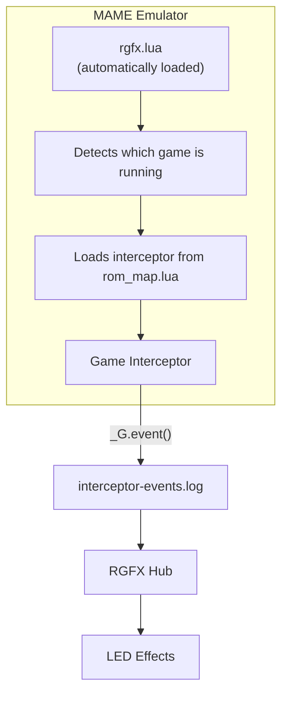

# Interceptors

Interceptors are how you add your favorite game to RGFX. They're the bridge between a game running in MAME and the LED effects on your setup — written in Lua, they watch the game's memory for meaningful moments and fire events when things happen.

RGFX ships with [example interceptors](../example-games.md) for several classic games, but the real power is writing your own. If you can find memory addresses with MAME's debugger and edit a text file, you can add any game. Community-contributed interceptors are welcome and will be merged into official releases.

## What Interceptors Do

Interceptors go far beyond simple memory monitoring. They:

- **Decode game-specific data formats** — Many classic games store values in unusual formats like BCD (Binary Coded Decimal). Interceptors translate these into usable numbers.
- **Detect gameplay events** — By watching for specific changes in memory, interceptors identify when significant actions occur: such as scoring points, defeating enemies, taking damage, or completing objectives.
- **Track game state** — Interceptors know whether you're in attract mode, actively playing, or between levels, and can track progression through the game.
- **Sample screen colors** — The ambilight feature captures colors from screen edges to create ambient lighting effects.
- **Analyze audio** — The FFT module performs real-time frequency analysis of game audio for sound-reactive lighting.
- **Extract sprite graphics** — The [sprite extraction](sprite-extraction.md) module reads ROM data to generate sprite images for use in LED bitmap effects.
- **Handle timing** — Boot delays suppress events during the power-on self test, preventing false triggers before gameplay begins.

## How the System Works



## Where Interceptors Live

Interceptors are stored in the `interceptors/` subdirectory of your [config directory](../getting-started/hub-setup.md#config-directory):

```
interceptors/
├── rom_map.lua           # Maps ROM names to interceptors
├── ambilight.lua         # Screen color sampling utility
├── fft.lua               # Audio analysis utility
├── sprite-extract.lua    # ROM sprite extraction utility
└── games/
    ├── pacman_rgfx.lua
    ├── galaga_rgfx.lua
    └── ...
```

When RGFX Hub first runs, it copies default interceptors to this location. You can customize these files — your changes won't be overwritten.

## Next Steps

- [Event System](events.md) — How to emit events from your interceptor
- [RAM Monitoring](ram.md) — Watch memory addresses for changes
- [Ambilight](ambilight.md) — Sample screen colors for ambient lighting
- [FFT Audio](fft.md) — React to game audio frequencies
- [Sprite Extraction](sprite-extraction.md) — Extract sprite graphics from ROM data
- [Writing Interceptors](writing-interceptors.md) — Create your own interceptor
- [MAME API Reference](mame-api.md) — Access MAME's Lua environment

Once events are flowing, [Transformers](../transformers/index.md) convert them into LED effects.
