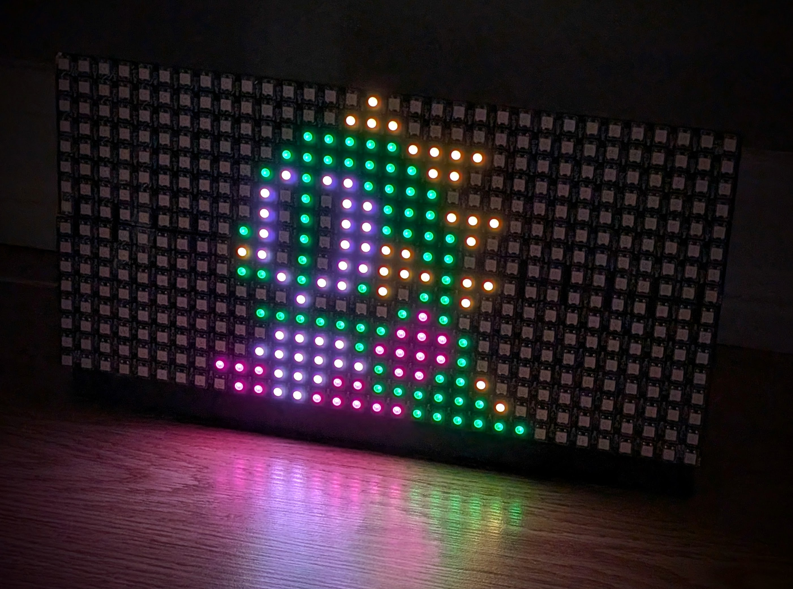

# GIF Bitmaps

The `loadGif` function loads animated GIF files and converts them to the bitmap effect format used by RGFX drivers.



## Usage

```javascript
const sprite = await loadGif('bitmaps/cherry.gif');
```

The function is available on the transformer context object:

```javascript
export async function transform({ subject, property, payload }, { broadcast, loadGif }) {
  const sprite = await loadGif('bitmaps/my-sprite.gif');
  // ...
}
```

## Parameters

| Parameter | Type | Description |
|-----------|------|-------------|
| `path` | string | Path to the GIF file, relative to the `transformers/` folder in your [config directory](../getting-started/hub-setup.md#config-directory) |

## Return Value

Returns a `GifBitmapResult` object:

| Property | Type | Description |
|----------|------|-------------|
| `images` | `string[][]` | Array of frames. Each frame is an array of row strings using hex characters (0-F) for palette indices. |
| `palette` | `string[]` | Array of up to 16 hex color strings extracted from the GIF's color table. |
| `width` | `number` | Width of the GIF in pixels. |
| `height` | `number` | Height of the GIF in pixels. |
| `frameCount` | `number` | Number of frames in the GIF. |
| `frameRate` | `number` | Frames per second (only present for animated GIFs with more than 1 frame). |

## Using with Bitmap Effect

The result from `loadGif` provides everything needed for the `bitmap` effect:

```javascript
const sprite = await loadGif('bitmaps/cherry.gif');

broadcast({
  effect: 'bitmap',
  props: {
    images: sprite.images,
    palette: sprite.palette,
    centerX: 50,
    centerY: 50,
    duration: 2000,
  },
});
```

## Caching Loaded Sprites

GIF files should be loaded once and cached for reuse. Loading the same file repeatedly impacts performance:

```javascript
const BONUS_ITEMS = {
  cherry: { score: 100, file: 'pac-bonus-1-cherry.gif' },
  strawberry: { score: 300, file: 'pac-bonus-2-strawberry.gif' },
};

export async function transform({ subject, property, payload }, { broadcast, loadGif }) {
  if (subject === 'player' && property === 'eat') {
    const bonusItem = BONUS_ITEMS[payload];

    if (bonusItem) {
      // Load sprite only once, then cache it
      if (!bonusItem.sprite) {
        bonusItem.sprite = await loadGif(`bitmaps/${bonusItem.file}`);
      }

      broadcast({
        effect: 'bitmap',
        props: {
          images: bonusItem.sprite.images,
          palette: bonusItem.sprite.palette,
          centerX: 50,
          centerY: 50,
          duration: 1000,
        },
      });
    }
  }
}
```

## Animation Support

For animated GIFs, the `frameRate` property indicates the playback speed:

```javascript
const animatedSprite = await loadGif('bitmaps/explosion.gif');

broadcast({
  effect: 'bitmap',
  props: {
    images: animatedSprite.images,
    palette: animatedSprite.palette,
    frameRate: animatedSprite.frameRate,  // Use GIF's timing
    centerX: 50,
    centerY: 50,
    duration: 2000,
  },
});
```

Override `frameRate` in props to change playback speed:

```javascript
broadcast({
  effect: 'bitmap',
  props: {
    images: animatedSprite.images,
    palette: animatedSprite.palette,
    frameRate: 12,  // Force 12 FPS regardless of GIF timing
    // ...
  },
});
```

## File Location

Place GIF files in subdirectories under `transformers/` in your config directory:

```
transformers/
├── bitmaps/
│   ├── cherry.gif
│   ├── explosion.gif
│   └── powerup.gif
└── games/
    └── pacman.js
```

## Color Palette Limitations

- GIFs are converted to a 16-color palette
- Colors beyond the first 16 in the GIF's color table are mapped using modulo
- Transparent pixels are preserved (rendered as spaces in the bitmap data)

## Error Handling

Handle loading errors gracefully to prevent transformer failures:

```javascript
try {
  const sprite = await loadGif('bitmaps/bonus.gif');
  // Use sprite...
} catch (err) {
  context.log.error('Failed to load sprite:', err);
  // Fallback behavior or skip the effect
}
```

Common errors:
- File not found at the specified path
- Invalid or corrupted GIF file
- GIF contains no frames
- GIF has no color table
